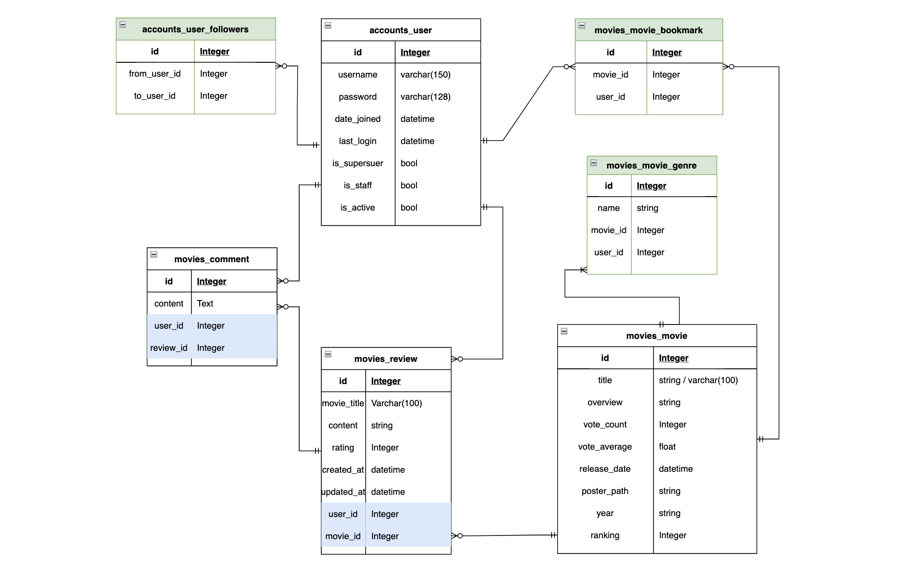
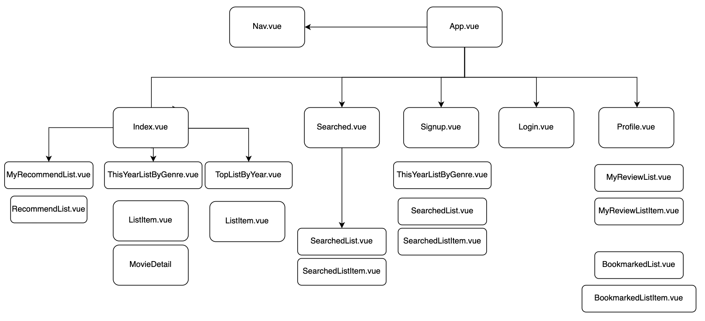
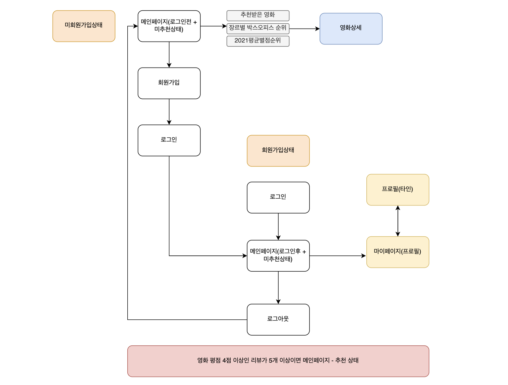
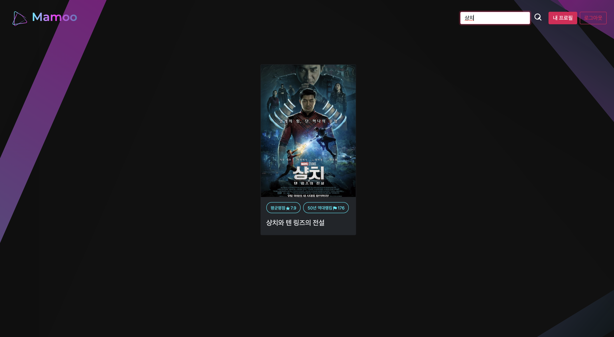

## MyMovieTaste, Mamoo

 같은 취향 영화추천 사이트


### 프로젝트 개요

- 주제 : 추천 알고리즘을 적용한 영화 사이트
- 콘셉트 : 다양한 영화에 리뷰를 남기면 자동으로 나와 비슷한 영화에 좋은 평점을 준, 취향이 비슷한 사람을 찾아 그 사람이 좋아하는 영화를 추천해준다. 추천받은 영화뿐 아니라 다양한 영화를 북마크할 수 있어 나만의 영화추천&보관이 가능하다. 또한 영화에 대한 평가를 자유롭게 남길 수 있다.
- 진행 기간 : 2020.11.17 ~ 11.25


---


### 팀원 정보 및 역할 분담

- 방의진 : 백엔드
- 손형선 : 프론트엔드


---

### 시연 안내

- git clone 
- frontend 실행

```bash
# 경로이동
$ cd frontend/
# 패키지 설치
$ npm i
# 실행
$ npm run serve
```

- backend 실행
  - 데이터베이스가 올라가있지 않기 때문에 json 파일을 디비에 저장해야 합니다.

```bash
# 경로이동
$ cd backend/
# pip 인스톨
$ pip install -r requirements.txt
# 가상환경 실행
$ source venv/bin/activate
```

```bash
# 1-> 2-> 3 순서로 진행

# 1. 장르 데이터 받아오기
$ python manage.py loaddata genres.json

# 2. 연도테이블 생성
# 'GET'방식으로 다음 주소를 요청해주세요 http://127.0.0.1:8000/movies/create_year_table/
# -> json 파일로 변경

$ python manage.py loaddata year.json

# 3. 영화 데이터 받아오기
$ python manage.py loaddata top_rated.json
```

```bash
# 서버 실행
python manage.py runserver
```


---


### 데이터베이스 모델링 (ERD)



---


### Vue Component




---

### User Flow




---


### 핵심기능 소개

- 추천 알고리즘
  - 로그인한 유저의 경우: 자신이 높게 평가한 상위 영화들 중 가장 많은 장르가 무엇인지 추출. 그 장르의 영화들 중 아직 사용자가 보지 않은 것들로 필터링하여 평균 별점 상위 영화 순으로 추천
  - 로그인하지 않은 경우: 안내메세지 출력

- 회원가입 및 로그인
  - 로그인 한 유저만 영화에 대한 평점을 등록 / 수정 / 삭제 가능하도록 인증 및 권한 구현

- 관리자 페이지를 통해 영화 추가 / 수정 / 삭제 가능
- 영화 상세 페이지 및 커뮤니티:
  - 영화 평점 및 상세정보 제공
  - 해당 영화에 등록된 리뷰 (게시글 및 세부 항목별 평가 내역) 목록 표시
  - 해당 리뷰에 달린 댓글 확인 및 추가 / 수정 / 삭제 가능
  - 리뷰 작성은 로그인 필수, 수정 및 삭제는 본인의 것만 가능

### 부가기능 소개

- 검색기능
  - 제목을 기반으로 검색

- 북마크 기능
  - 마이페이지에서 북마크한 영화 확인


### 미구현(추후 추가할) 기능 소개

- 팔로우 기능
  - 특정 유저를 팔로우할 수 있는 기능

- 친구매칭도 기능
  - 내가 추천받은 영화와 친구가 추천받은 영화를 비교하여 겹치는 영화를 추천해주는 기능
- 추천알고리즘에 장르비율 적용 (A가 평점을 남긴 영화들 중 가장 많은 장르가 무엇인지 추출, 각 장르별 비율대로 B에게 추천.) 현재 A의 장르비율까지 구한 상태.


---


### 추천 알고리즘 

### "나와 비슷한 영화를 좋아한 유저가 높은 평점을 준 영화를 추천해주는 서비스"

- **콜레보레이트 필터링**이란 A와 B 사이의 공통점을 근거로 하는 방법이다. A란 가입자가 ‘가, 나, 다’란 영화를 재밌게 봤고, B란 가입자가 ‘가, 다, 라’란 영화를 재밌게 봤다면, ‘가’와 ‘다’는 A와 B 모두 공통으로 재밌게 본 영화고, A에겐 ‘라’를 B에겐 ‘나’를 추천할 수 있다. 공통요소를 뽑을 사용자규모가 더 커지면 그 정확도는 높아질 것이다.

- 로그인 후  **좋아하는(4점 이상 준 영화)** 영화를 5개 이상 리뷰로 작성했을 때 함수가 동작
- **내가 리뷰를 남긴 영화를 똑같이 리뷰남긴 다른 유저의 리스트에서 높은 평점(4점 이상) 중 내가 지금 고른 리뷰와 겹치지 않는 영화를 추천**
- 만약 추천 갯수가 5개 미만이면, 인기도 순(popularity), 최신순으로 5개를 더 출력한다.


---


### 화면 소개

- 메인페이지
  - 장르별 최신 개봉영화 - 장르 선택가능


- 연도별 평점순 영화 - 연도 선택가능


- 평균평점 및 50년 역대랭킹 출력


- 영화 상세 모달


- 회원가입 및 로그인


- 리뷰 작성 및 수정, 삭제 - 본인의 게시글만 가능


- 영화 추천


- 영화 검색



- 영화 북마크 기능
  - 마이페이지에서 출력(미구현)


---


### 사용 기술 및 버젼

- 언어
  - Python 3.9.6
  - Django 3.2.9
  - Node LTS
  - Vue.js 2.6.14
- 툴
  - VSCode
  - Chrome Browser
- 아키텍쳐
  - Django & Vanilla JS
  - Django REST API Server & Vue.js

