# BackEnd

방의진

12.16 변경사항
- API KEY 숨김
- permission_class 수정
- simple jwt 문제로 jwt로 다시 수정, 에러 디버깅


12.15 변경사항

- JWT SECRET KEY 설정
- year 데이터 json 파일로 저장

  

### 프로젝트 후기

- API를 저장하는 첫 순간부터 새로운 것을 배우고 찾아가며 진행했던 프로젝트였습니다.
- Github 브랜치를 활용하여 작업을 진행하였습니다.


### 큰 줄기들

##### 1. 어떤 API 를 사용해야 하지?

영화진흥원, 네이버 영화, TMDB API 등 다양한 API 서비스가 존재하였습니다. 우리는 영화정보를 보여주고 추천해주는 서비스가 MVP 였기 때문에 영화의 제목과 랭킹이 잘 구현되어있는 TMDB API를 사용하였습니다. 네이버 영화는 하나씩 검색만 할 수 있는 구조였으며 영화진흥원은 json의 데이터구조가 TMDB 와 아주 달라 TMDB API만을 사용하였습니다.

##### 2. API를 받아는 왔는데.. 어떻게 저장하지?

그동안의 실습에서는 주어진 json 파일을 사용하거나 이미 정제된 API를 사용하였습니다. 그러나 이번 프로젝트는 모델링부터 직접 커스터마이징하였기 때문에 필요한 모델에 맞는 json 형태로 데이터를 저장해야 했습니다. 따라서 api를 우리 모델에 맞게 저장하는 함수를 따로 작성하였으며 받아온 데이터의 id가 랭킹이 아닌 영화 고유의 아이디였기 때문에, 토탈 랭킹을 구하기 위해 추가적인 필드(ranking)도 하나 작성하였습니다. 

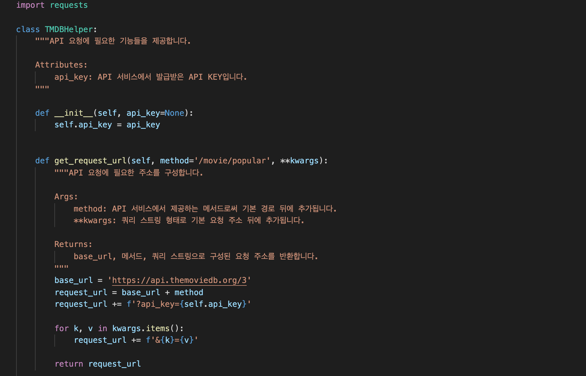

TMDBHelper 라는 클라스를 만들어 API를 요청하였고, 해당 API 주소를 불러와서 필드에 맞게 새롭게 추가하여

json 의 dump 메서드를 활용하여 json 파일로 저장하게 됩니다.

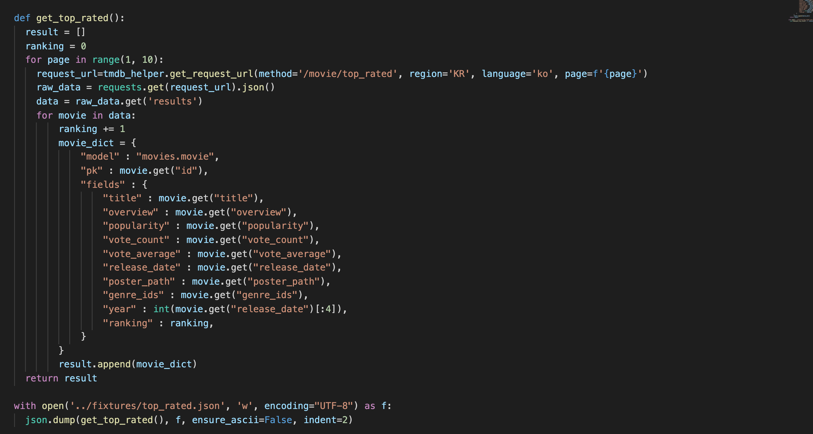

​		이 파일은 이후 `loaddata` 로 데이터베이스에 저장할 수 있습니다.


##### 3. 모델을 어떻게 만들어야 하지?

기본 Movie 모델을 만든 이후에도, ERD를 그려나감에 있어서 고민을 많이 하였습니다. 우리의 핵심기능인 영화추천과 필터링하는 추천기능 등을 구현하기 위해 필요한 모델이 무엇일까, 최소한의 변경을 위해 초반부터 고심하였습니다. 필드를 정의내리고 일대 다, 다대다 관계를 설정하였습니다.

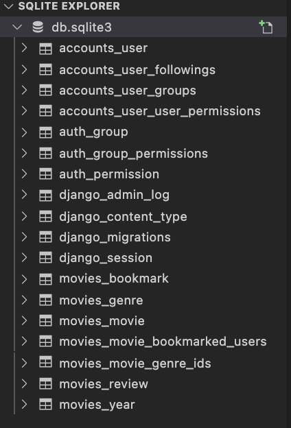

##### 4. 연도테이블이 없는데, 어떻게 생성하지?

​	출시 연도별로 영화를 뽑기 위해, 연도테이블이 필요했습니다. 기존의 Movie 모델에도 연도가 있었지만 원하는 json 형태로 만드는데 	어려움이 있다고 파악되어 연도를 id로 하는 테이블을 새롭게 생성하였습니다.

​	이를 위해 `bulk_create` 메서드를 사용하였습니다.

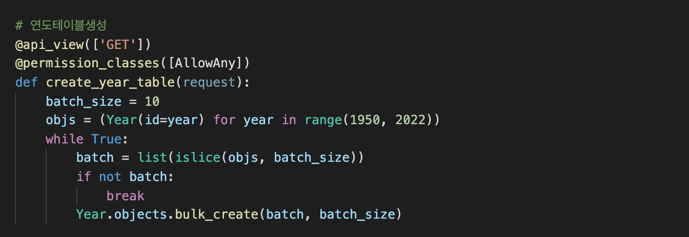

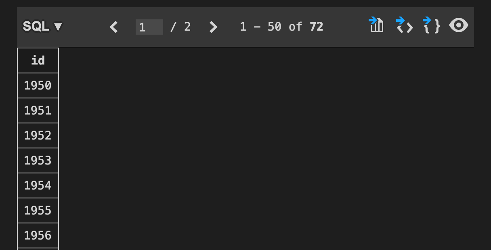

##### 5. 장르별 최신 개봉영화를 뽑아내기 & 연도별 고평점 영화를 뽑아내기

json 형태를 장르/연도별로 데이터가 나열되게 구성하고 싶었습니다. 하나의 장르 리스트 안에 해당 장르의 영화가 여러개 들어있는 형태인 것입니다. 이러한 구성을 위해 `sereiallizer` 를 조작하였으며 `SerializerMothodField` 를 사용하게 됩니다.

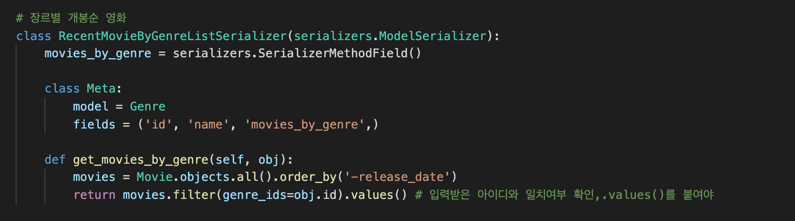

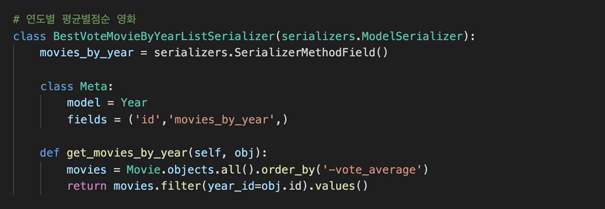

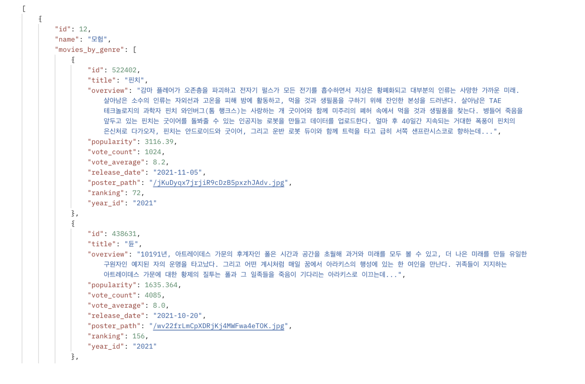

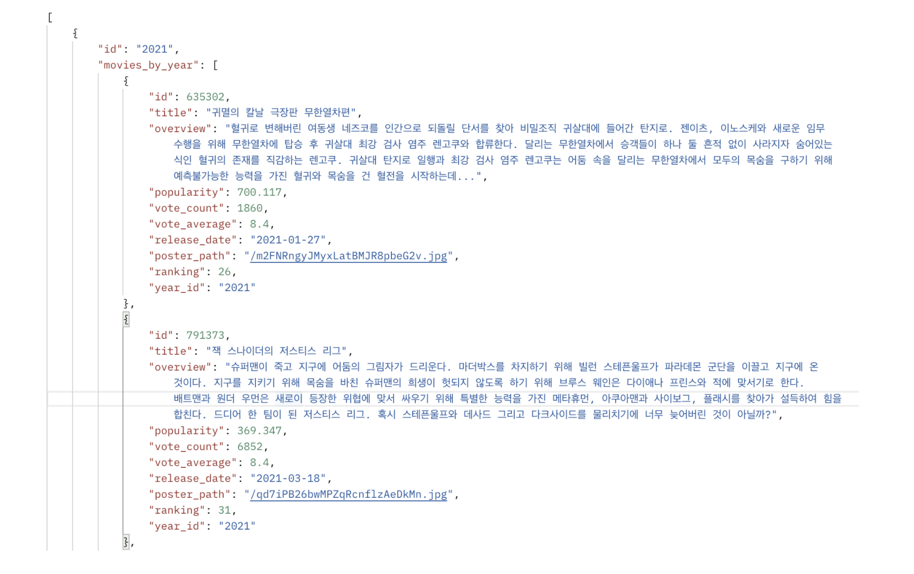

이 형태로 뽑아내는것이 front 단에서 장르별/연도별로 처리하기 쉬울거라고 생각하여, 열심히 구글링해가며 만들었습니다. 이 방법이 단 하나의 정답은 아니겠지만 공식문서를 찾고 적용해가며 고군분투하여 결과물이 나왔을 때 무척 기뻤습니다.

그러나 기쁨도 잠시, 이렇게 출력된 결과물은 북마크가 안된다는 치명적인 오류가 있었습니다....

필드에 Many to Many 관계인 "bookmarked_users" 가 출력되지 않았습니다. 왜일까.....왜왜왜

결국 구글링 끝에 유사한 질문과 답변을 찾아 해결하였습니다. 무비시리얼라이저를 다시 불러오고 .data로 출력하였습니다.

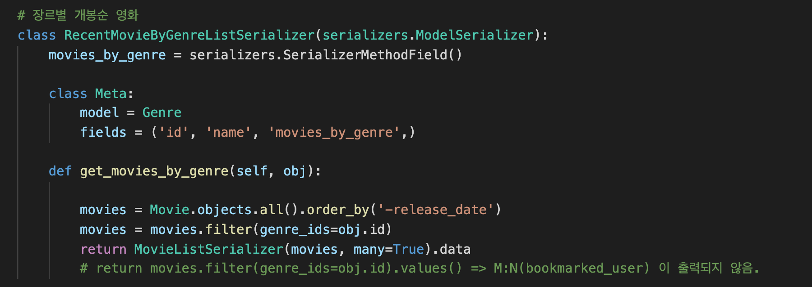

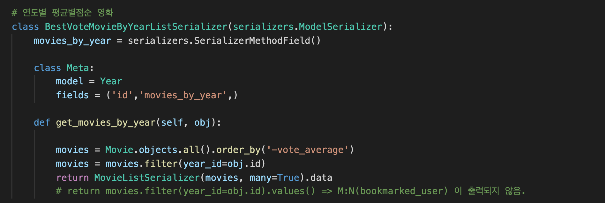

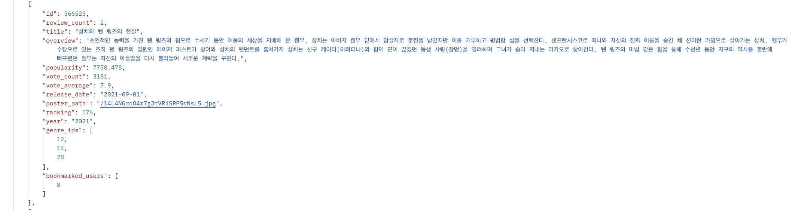

##### 6. 결국 중요한건 영화추천 알고리즘

엄청난 주석 TMI 를 자랑하는 MAMOO의 핵심 ! 추천 알고리즘입니다. 한 땀 한 땀 제작하였습니다. 코드를 줄이기보다는 최대한 명확하게 보일 수 있도록 제작하였습니다.

1. 유저가 4점이상 준 리뷰가 5개를 넘어가면 추천이 시작됩니다.
2. 유저가 남긴 리뷰를 제외한 리뷰 중 같은 영화의 리뷰를 남긴 유저를 찾습니다.
3. 비슷한 취향인 유저가 리뷰를 준 리스트에서 높은 평점을 준 영화중 내가 쓴 리뷰의 영화와 겹치지 않는 영화를 찾습니다.
4. 추천 리뷰의 갯수가 5개 미만이면 인기도순 최신순으로 5개를 더 출력합니다.

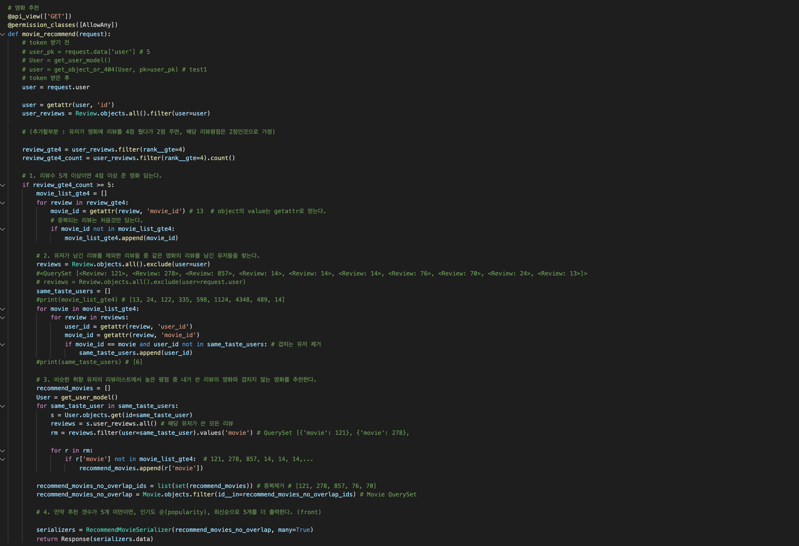

추가적으로 장르비율의 데이터까지 확보하였습니다. 여력이 된다면 프론트단에서 '당신이 리뷰를 남긴 영화의 장르비율' 을 그래프로 멋드러지게 구현할 수 있을것이라 기대합니다.

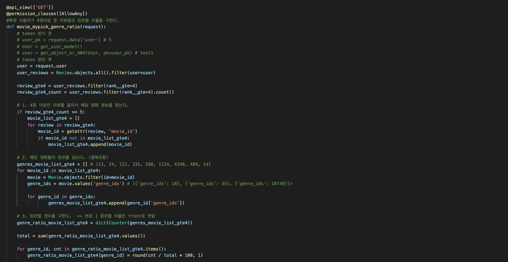


##### 7. ORM 을 익히기

데이터를 조작하기 위해 ORM 을 자유자재로 활용할 수 있어야 했습니다. 이 부부은 블로그에 정리를 해두었습니다. 익숙해지니 재밌더군요!

https://ninefloor-design.tistory.com/253


##### 8. 어드민 페이지도 잘 만들어야지

장고의 강력한 기능인 Admin 기능은 손쉽게 구현할 수 있고, 모델만 잘 짜두었다면 바로 사용할 수 있어 매력적입니다. 열려라 참깨 하고 외치듯 장고야 슈퍼유저 만들어줘!!하면 잘 만들어줍니다. 모델에서 놓친 부분이 있으면 어드민을 통해 확인해볼 수 있다는 점도 장점인 것 같습니다.

```bash
$ python manage.py createsuperuser
```

이후 admin.py에서 모델 클래스도 등록해야 합니다. 등록 형식이 정해져 있어요. (우측의 경우 한 번에 하나의 클래스만 등록가능해서 무조건 4줄이 나오게 됩니다. 콤마로 한줄로 쓸 수 없습니다.)

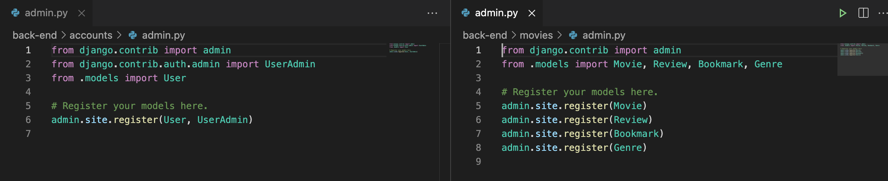


##### 9. 기타 어려움에 관하여

구글링을 200번은 한 것 같습니다. 스택오버플로우도 수도없이 들어갔어요. 장고 커뮤니티 왜 없어,, 하면서 원망도 했던 것 같습니다. 다른 앱에 있는 모델을 불러오는 것도 쉽지 않았고 get과 post를 구분하여 데이터를 받아주어야 하는것도 몰랐습니다. 시리얼라이저 구성은 말할것도 없었고요. java 생태계는 좀 더 자료가 많을까요..? 어찌되었던 많이 검색하고 배웠던 시간이었습니다. 동료가 제가 벌크를 돌리는 걸 보고 누나 벌크업 했다! 라고 하던데, 역시 프로젝트를 해야 사람이 성장하는 것 같습니다.


---


### 디자인과 UI에 관하여

저는 디자이너라는 특이한 이력을 가지고 있습니다. 이번 프로젝트에서 백엔드를 맡고 마무리 부분으로 디자인 작업을 진행하였는데요, vue에서 css를 적용하는 것이 신기하였고, 무엇보다 scss는 처음 사용해 보았습니다.

여전히 bootstrap의 flex와 grid, column은 헷갈리는 존재입니다.

언젠가는 마스터 할 날이 오겠죠?


---


### Githup 업로드 방법

1. `master` 브랜치에서 자신의 브랜치 생성 (브랜치명 mybranch라고 가정)

```bash
git branch mybranch
```

2. 자신의 브랜치로 이동

```bash
git checkout mybranch
```

3. 작업 후 브랜치에 업로드

```bash
git add .
git commit -m "..."
git push
```

4. `master` 브랜치로 이동

```bash
git checkout master
```

5. `master` 브랜치에 `newbranch` 변경사항 반영

```bash
git merge mybranch
```

### Github 받는 방법

1. 자신의 브랜치로 이동

```bash
git checkout mybranch
```

2. `master` 의 변경사항을 내 브랜치에 반영

```bash
git pull master
```

3. `conflict` 충돌 발생시 파일로 들어가서 수정
4. 수정한 완료하면 내 브랜치에 반영

```bash
git add .
git commit -m ""
#=> 이때 vim 창이 나타나면  :wq    로 종료
```

5. `master` 브랜치로 이동 후 마스터에 내 브랜치의 변경사항 반영 (위의 5번과 동일)